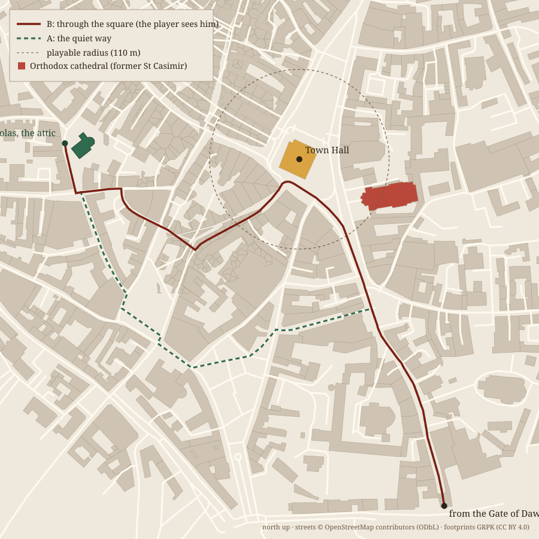

# The knygnešys — character brief

Version 0.1 · 2026-09-28 · status: **brief, not built**

A book courier for the Lithuanian circle in Vilnius, carrying banned Lithuanian-language
publications from the Gate of Dawn to the attic of St Nicholas' Church. The person is invented;
the role, the route's two ends, the attic and the people waiting there are documented.

Tags follow `docs/REFERENCES.md`: **[V]** verified against a cited source, **[U]** unverified
or a design choice.

---

## 1. Why he belongs in this square

- **The ban.** From 1864 to 1904 it was illegal to print, import, distribute or possess
  Lithuanian publications in the Latin alphabet. [V] ¹
- **The smuggling mostly happened elsewhere.** Books were printed in Lithuania Minor (East Prussia)
  and carried into Samogitia, Suvalkija and Aukštaitija. Vilnius was the seat of the
  Governor-General who enforced the ban. [V] ¹ ²
- **But it reached this street.** A circle of about twelve Lithuanians, the "Twelve Apostles of
  Vilnius" (c. 1895; a priest, a nobleman and a forester among the founders), met in private flats.
  "From 1900, members of the club organized regular deliveries of Lithuanian publications from
  East Prussia, hid them in their apartments or the attic of the Church of Saint Nicholas, and
  arranged their distribution." [V] ³
- **The Okhrana knew.** It had an informant report on the club but took no action. [V] ³
- **He is rare.** The 1897 census counted 3,238 Lithuanian and Samogitian speakers in a city of
  154,532 (2.1%), against 40% Yiddish, 31% Polish and 20% Russian speakers. He walks through a
  city that mostly does not speak his language. [V] ⁴ ⁵

## 2. When

- **Set it in 1902–1903.** St Nicholas was handed to the Lithuanian community on
  **31 December 1901**, with **Juozapas Kukta** as its priest, and the ban lasted until 1904. Those
  years give an attic with a sympathetic priest and a ban still in force. [V] ⁶ ⁷ The game's
  "c. 1900" covers this.
- **Season.** Every light preset in `src/main.ts` is dated **24 June**, and Vilnius barely gets
  dark in June:

  | Date | Sunset | Civil dusk | Nautical dusk | Full night | Sunrise |
  |---|---|---|---|---|---|
  | 24 June (game) | 20:42 | 21:39 | — | — | 03:25 |
  | 15 October | 17:00 | 17:36 | 18:18 | 19:00 | 06:32 |
  | 15 November | 15:57 | 16:38 | 17:22 | 18:05 | 07:34 |
  | 15 December | 15:34 | 16:19 | 17:07 | 17:51 | 08:19 |

  Local mean solar time (UTC+1:41), from the vendored suncalc at `VILNIUS` in `sky.ts`.
  Whether city clocks kept local time in 1902 is [U].

  So there are two versions of him:

  - **Summer (buildable now, `rain` preset, 13:30).** He moves in daylight, in the market crowd
    and the rain: hat brim down, sack like any carrier's. Crowd and weather are his only cover.
    Take **route B** through the square.
  - **November dusk (needs a new light preset).** He leaves the Gate of Dawn at civil dusk
    (~16:40) and reaches the attic before full dark (~16:52). This is when the lamplighter works
    the same streets, so each lit lamp is a small danger to him, which ties the two characters
    together [U, design]. Take **route A**.

## 3. The route

Both routes run on the game's own street graph (`public/data/area.json` roads), so the waypoints
can be used as they are. Frame: `X = E − 583000, Z = −(N − 6061000)`, metres, +Z south.
Waypoints: [`knygnesys-route.json`](knygnesys-route.json).

**Start:** just inside the **Gate of Dawn**, the south end of Aušros Vartų g., at (170.5, 480.5),
460 m from the Town Hall. It is the only city gate still standing after 1799–1805. [V] ⁸ He enters
from the south because the railway station lies beyond the gate. How the club actually brought
deliveries into the city is **not documented** [U, design].

**End:** **St Nicholas' Church**, Šv. Mikalojaus g. 4, OSM way 55447268, at (−268.0, 36.5),
**262 m west-south-west of the Town Hall**. [V] The projection was checked against the game's own
road vertices to 0.00 m.

### Route B — through the square (the player sees him)

**841 m, about 11.7 min** loaded (1.2 m/s). **170 m of it inside the playable radius.**

| Leg | Length |
|---|---|
| Aušros Vartų g. | 287 m |
| Didžioji g. (past the Orthodox cathedral) | 81 m |
| Rotušės a. (Town Hall Square) | 96 m |
| Rūdninkų g. | 136 m |
| Dysnos g. | 123 m |
| Ašmenos g. | 50 m |
| Žemaitijos g. | 6 m |
| Šv. Mikalojaus g. | 63 m |

This is also the **shortest** way from the gate to the church. The natural route crosses the
player's square.

### Route A — the quiet way

**846 m, about 11.8 min.** None of it is inside the playable radius. It leaves Aušros Vartų g.
before the square, takes Pasažo skg., footways, Visų Šventųjų, a few metres of Rūdninkų, footways,
Mėsinių and Šiaulių, and rejoins at Žemaitijos → Šv. Mikalojaus.

**Only 5 m longer than B.** Crossing the square saves him almost nothing. He does it to be lost in
a crowd, or because he is careless. That is a decision a player can read.

### Caveats on the route

- **Street names are modern.** Around 1900 many streets carried Russian imperial names. [V] ⁹
- **Route A runs on modern footways** (the unnamed segments and Pasažo skg.). Check each one against
  the 1866 plan in `tools/reconstruction/src/` and a c. 1900 plan before trusting it. [U]
- **The church is not modelled.** It is outside `walkRadius` (110 m) and inside `contextRadius`
  (450 m). Either extend the walkable area west, or let the player see him vanish down Rūdninkų g.
  at the edge of the walk.

## 4. Beats along route B

1. **Gate of Dawn.** Pilgrims at the chapel. A man with a sack of books among people with prayer
   books. [U, design]
2. **The Orthodox cathedral.** St Casimir's was rebuilt as the **Orthodox Cathedral of St Nicholas**
   in 1864–68: towers lowered, onion domes in place of the crown. `stcasimir.ts` already builds this
   c. 1900 front. [V] ¹⁰ He passes the most visible symbol of what he works against.
3. **Two St Nicholases.** In 1902 "St Nicholas" meant the Orthodox cathedral on the square *and* the
   small Catholic church 260 m west. Both facts are [V] ⁶ ¹⁰. A courier who goes to the wrong one
   walks into the Empire's own cathedral with a sack of contraband. [U, design hook]
4. **Town Hall Square.** The market crowd is his cover. The player can pass him here without
   knowing.
5. **Rūdninkų g. and west.** Narrow streets on the edge of the Jewish quarter, where he is watched
   less.
6. **The attic.** Kukta takes the sack.

## 5. Cast around him

| Role | Status | Notes |
|---|---|---|
| **The courier** | invented person, real role | Rural, Lithuanian-speaking; in the city he is a stranger |
| **Juozapas Kukta** | real [V] ⁶ ⁷ | Priest of St Nicholas from 31 Dec 1901; also chaplain at the Commercial School and a juvenile prison |
| **The Okhrana informant** | real role, unnamed [V] ³ | Reported on the club; nothing followed. Knows everything and does nothing |
| **Gorodovoy** (police) | [U] | Where posts and patrols stood in the Old Town c. 1902 is unresearched |

## 6. What he carries, and what happens if he is caught

- **Lithuanian publications from East Prussia.** [V] ³ Which titles (prayer books, calendars,
  periodicals) is [U]. Needs research.
- **About a third of all smuggled books were seized.** In the late 1890s, 30,000–40,000 books a
  year were smuggled in. [V] ¹
- **If caught:** fines, banishment, or exile, including to Siberia. [V] ¹

## 7. Building him (for the next session)

- NPC townsfolk (`src/world/folk.ts`) and the player walker (`src/player/walker.ts`) are separate.
  The courier needs a **scripted route follower** that walks the waypoints at 1.2 m/s, with a sack
  and a slightly heavier gait than the townsfolk.
- Reuse the townsfolk clothing pipeline: coat, cap, muddy hems.
- The **November dusk** version needs a new entry in `LIGHTS` (`src/main.ts`) and wet-dusk
  lamplight. It pairs with the lamplighter.
- Regenerate the route and map with `python tools/characters/knygnesys_route.py` (standard library only) if the street data changes.

## 8. Open questions

1. How deliveries actually reached the club: rail, cart, or on foot, and by which gate?
2. What exactly was in the sacks?
3. Where were police posts in the Old Town c. 1902?
4. Did the modern footways on route A exist in 1902?
5. What were the 1902 names of Dysnos, Ašmenos and Žemaitijos?
6. Were lamps in these streets lit by hand in 1902, and at what time?

## Sources

1. [Lithuanian book smugglers](https://en.wikipedia.org/wiki/Lithuanian_book_smugglers)
2. [Lithuanian press ban](https://en.wikipedia.org/wiki/Lithuanian_press_ban)
3. [Lithuanian Mutual Aid Society of Vilnius](https://en.wikipedia.org/wiki/Lithuanian_Mutual_Aid_Society_of_Vilnius)
4. [Demographics of Vilnius](https://en.wikipedia.org/wiki/Demographics_of_Vilnius)
5. [Население Вильнюса](https://ru.wikipedia.org/wiki/Население_Вильнюса)
6. [Vilniaus Šv. Mikalojaus bažnyčia](https://lt.wikipedia.org/wiki/Vilniaus_%C5%A0v._Mikalojaus_ba%C5%BEny%C4%8Dia) · [Church of Saint Nicholas, Vilnius](https://en.wikipedia.org/wiki/Church_of_Saint_Nicholas,_Vilnius)
7. [Juozapas Kukta](https://en.wikipedia.org/wiki/Juozapas_Kukta)
8. [Wall of Vilnius](https://en.wikipedia.org/wiki/Wall_of_Vilnius)
9. [Imperialization of street names in late imperial Vilnius, *Urban History*](https://www.cambridge.org/core/journals/urban-history/article/imperialization-of-street-names-as-part-of-the-cultural-appropriation-of-urban-space-in-late-imperial-vilnius/2177AA84E0AD88ECE05B40E2DE4F0C6C)
10. [Church of St. Casimir, Vilnius](https://en.wikipedia.org/wiki/Church_of_St._Casimir,_Vilnius)

Map data: streets © OpenStreetMap contributors (ODbL); footprints GRPK © Nacionalinė žemės
tarnyba (CC BY 4.0).
